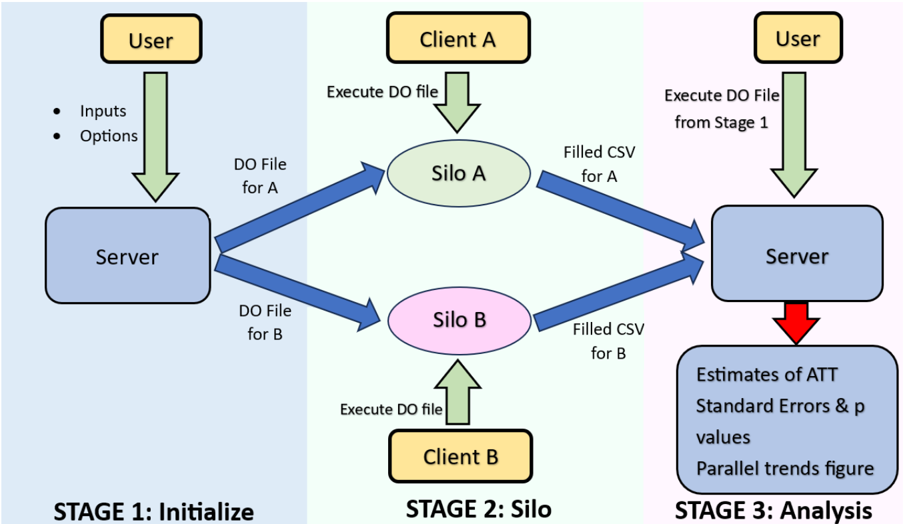

# undidjl
This Stata package acts as a wrapper for the Julia package Undid.jl. 

Undid allows for estimation of difference-in-differences with unpoolable data, see https://arxiv.org/abs/2403.15910 for more details.

## Installation 
```
net install undidjl, from("https://raw.githubusercontent.com/ebjamieson97/undidjl/main/")
```
## Requirements
* Julia 1.9.4 or later
* Stata 14.1 or later
* the julia package for Stata, see https://github.com/droodman/julia.ado

### Utility Commands
These commands allow for managing the Undid.jl package for Julia from Stata:

1. **checkundidversion**: Displays the currently installed Undid.jl version number and the latest Undid.jl version number. Installs the latest version of Undid.jl if no version of Undid.jl is currently installed.
2. **updateundid**: Updates Undid.jl to the latest version if Undid.jl is already installed.


## Stage One: Initialize
These commands are used during the first stage of the undid process:

3. **create_init_csv**: Creates an initial .csv file (init.csv) specifying the silos, start times, end times, and treatment (or lack thereof) times.
4. **create_diff_df**: Creates an empty .csv file (empty_diff_df.csv) using information from the init.csv specifying the required differences to be calculated at each silo.

##### Examples
```stata
create_init_csv, silo_names("71 73 58 46") start_times("1989 1989 1989 1989") end_times("2000 2000 2000 2000") treatment_times("1991 control 1993 control") covariates("asian black male")
init.csv saved to
C:/Users/User/Documents/Project Files/init.csv
```
##### Details
Calling `create_init_csv` will return the filepath where the created init.csv is saved and its contents will appear in the active Stata dataset. All of the options for `create_init_csv` are optional and thus `create_init_csv` can be called to create a blank init.csv file with only the appropriate headers which can then be filled out manually. Dates can be entered in a wide variety of formats shown [here](#valid-date-formats). Ensure that dates are consistently entered in the same format when creating the init.csv. Control silos should be marked with "control" in the treatment_times column (e.g. silos 73 & 46 in the above example). Covariates can either be specified when creating the init.csv or when calling `create_diff_df`.

## Stage Two: Silo
This command is used during the second stage of the undid process at each silo:

5. **undidjl_state_two**: Grabs information from the empty_diff_df.csv and the local silo data to fill out that silo's portion of the empty_diff_df.csv which is then saved as filled_diff_df_$local_silo_name.csv. Also computes trends data of the outcome of interest which is saved as trends_data_$local_silo_name.csv.

## Stage Three: Analysis
These commands are used during the third and final stage of undid:

6. **undidjl_stage_three**: Executes the third stage of undid.
7. **plot_parallel_trends**: Plots the parallel trends figures.


### Appendix

#### Valid Date Formats
- `ddmonyyyy` → 25dec1990
- `yyyym00` → 1990m12
- `yyyy/mm/dd` → 1990/12/25
- `yyyy-mm-dd` → 1990-12-25
- `yyyymmdd` → 19901225
- `yyyy/dd/mm` → 1990/25/12
- `yyyy-dd-mm` → 1990-25-12
- `yyyyddmm` → 19902512
- `dd/mm/yyyy` → 25/12/1990
- `dd-mm-yyyy` → 25-12-1990
- `ddmmyyyy` → 25121990
- `mm/dd/yyyy` → 12/25/1990
- `mm-dd-yyyy` → 12-25-1990
- `mmddyyyy` → 12251990
- `mm/yyyy` → 12/1990
- `mm-yyyy` → 12-1990
- `mmyyyy` → 121990
- `yyyy` → 1990

#### Undid Schematic 


