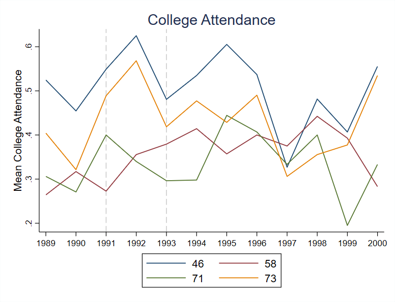
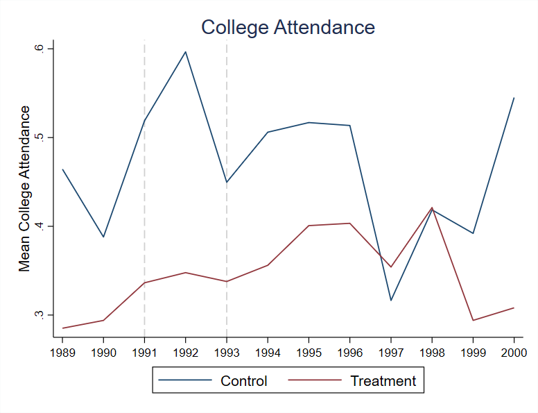
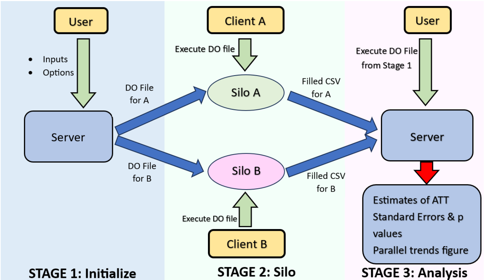

# undidjl
This Stata package acts as a wrapper for the Julia package Undid.jl. 

undidjl allows for estimation of difference-in-differences with unpoolable data, see https://arxiv.org/abs/2403.15910 for more details.

## Installation 
```stata
net install undidjl, from("https://raw.githubusercontent.com/ebjamieson97/undidjl/main/")
```
### Update
```stata
ado uninstall undidjl
net install undidjl, from("https://raw.githubusercontent.com/ebjamieson97/undidjl/main/")
```

## Requirements
* Julia 1.9.4 or later
* Stata 14.1 or later
* the julia package for Stata, see https://github.com/droodman/julia.ado

## Utility Commands

#### 1. `checkundidversion`

Displays the currently installed and the latest version of the Undid.jl package. If Undid.jl is not installed, installs Undid.jl.

#### 2. `updateundid`

Updates Undid.jl to the latest version if Undid.jl is already installed.

## Stage One: Initialize

#### 3. `create_init_csv` - Creates an initial .csv file (init.csv), displays its filepath, and returns its contents to the active Stata dataset.

Generates an initial `.csv` file (`init.csv`) specifying the silo names, start times, end times, and treatment times. This file is then used to create the `empty_diff_df.csv`, which is sent to each silo. If `create_init_csv` is called without providing any silo names, start times, end times, or treatment times, an `init.csv` will be created with the appropriate column headers and blank columns. 

Control silos should be marked with "control" in the treatment_times column.

Covariates may be specified when calling `create_init_csv` or when calling `create_diff_df`.

Ensure that dates are all entered in the same date format, a list of acceptable date formats can be seen [here.](#valid-date-formats)

**Parameters:**

- **silo_names** (*string, optional*):  
  A string specifying the different silo names.
  
- **start_times** (*string, optional*):  
  A string which indicates the starting time for the analysis at each silo.

- **end_times** (*string, optional*):  
  A string which indicates the starting time for the analysis at each silo.

- **treatment_times** (*string, optional*):  
  A string which indicates the treatment time at each silo. Control silos should be labelled with the treatment time `"control"`.

- **covariates** (*string, optional*):  
  A string specifying covariates to be considered at each silo.

```stata
* Using a subset of data from the merit scholarship example shown in https://arxiv.org/abs/2403.15910

. create_init_csv, silo_names("71 73 58 46") start_times("1989 1989 1989 1989") end_times("2000 2000 2000 2000") treatment_times("1991 control 1993 control") covariates("asian black male")

init.csv saved to
C:/Users/User/Documents/Project Files/init.csv
```

#### 4. `create_diff_df` - Creates the .csv file to be sent out to each silo (empty_diff_df.csv), displays its filepath, and returns its contents to the active Stata dataset.

Creates the `empty_diff_df.csv` which lists all of the differences that need to calculated at each silo in order to compute the aggregate ATT. The `empty_diff_df.csv` is then sent out to each silo to be filled out.

**Parameters:**

- **filepath** (*string, required*):  
  A string specifying the filepath to the `init.csv`.
  
- **date_format** (*string, required*):  
  A string which specifies the [date format](#valid-date-formats) used in the `init.csv`. 

- **freq** (*string, required*):  
  A string which indicates the length of the time periods to be used when computing the differences in mean outcomes between periods at each silo.
  - "daily", "weekly", "monthly", or "yearly"

- **covariates** (*string, optional*):  
  A string specifying covariates to be considered at each silo. If left blank uses covariates from `init.csv`. 

- **freq_multiplier** (*integer or string, optional*):  
  Specify if the frequency should be multiplied by a non-zero integer. For example, if the time periods to consider are two years, set `freq("yearly") freq_multiplier(2)`.

```stata
. create_diff_df, filepath("C:/Users/User/Documents/Project Files/init.csv") date_format("yyyy") freq("yearly")

empty_diff_df.csv saved to
C:/Users/User/Documents/Project Files/empty_diff_df.csv
```


## Stage Two: Silo

#### 5. `undidjl_stage_two` - Creates an two .csv files (filled_diff_df_$silo_name.csv and trends_data_$silo_name.csv), displays their filepaths, and returns one .csv's contents to the active Stata dataset.

Based on the information given in the `empty_diff_df.csv`, computes the appropriate differences in mean outcomes at the local silo and saves as `filled_diff_df_$silo_name.csv`. 

Note that the `time_column` should reference a string variable. This is in order to facilitate passing date information between Stata and Julia. 

Further, covariates at the local silo should be renamed to match the spelling used in the `empty_diff_df.csv`. 

**Parameters:**

- **filepath** (*string, required*):  
  A string specifying the filepath to the `empty_diff_df.csv`.
  
- **local_silo_name** (*string, required*):  
  A string which specifies the local silo's name as it is written in the `empty_diff_df`. 

- **time_column** (*string, required*):  
  A string which indicates the name of the variable in the local silo data which contains the date information. This variable should be a string. 

- **outcome_column** (*string, required*):  
  A string specifying the name of the variable in the local silo data which contains the outcome of interest.

- **local_date_format** (*string, required*):  
  A string specifying the [date format](#valid-date-formats) used in the `time_column` variable. 
  
- **consider_covariates** (*string, optional*):  
  A string which if set to `false` ignores computations involving the covariates specified in the `empty_diff_df.csv`. Defaults to `true`. 

- **view_dataframe** (*string, optional*):  
  Specify which dataframe should be passed back to Stata's active dataset. Either `"trends"` or `"diff"`. Defaults to `"diff"`.

```stata
* An analogous script would be run at each silo (71, 73, 58 and 46)
. use "C:\Users\User\Data\State73.dta", clear
. undidjl_stage_two, filepath("C:/Users/User/Documents/csvs/empty_diff_df.csv") local_silo_name("73") time_column("date_str") outcome_column("coll") local_date_format("ddmonyyyy") view_dataframe("trends")

filled_diff_df_73.csv saved to
C:/Users/User/Current Folder/filled_diff_df_73.csv
trends_data_73.csv saved to
C:/Users/User/Current Folder/trends_data_73.csv
```

## Stage Three: Analysis

#### 6. `undidjl_stage_three` - Computes and displays UNDID results (aggregate ATT, standard errors, p-values).

Takes in all of the `filled_diff_df_$silo_name.csv`'s and uses them to compute the aggregate ATT and standard errors. If errors persist, check to see if there are missing values of `diff_estimates` in the `combined_diff_data.csv` and if so consider setting `interpolation = "linear_function"`. 

**Parameters:**

- **folder** (*string, required*):  
  A string specifying the filepath to the folder containing all of the `filled_diff_df_$silo_name.csv`'s.
  
- **agg** (*string, required*):  
  A string which specifies the aggregation methodology for computing the aggregate ATT. Either `"silo"`, `"g"`, or `"gt"`. Defaults to `"silo"`. 

```stata
. undidjl_stage_three, folder("C:/Users/User/Documents/Files From Silos") agg("g")

Saving combined_diff_data.csv to C:\Current Working Directory
Saving UNDID_results.csv to C:\Current Working Directory

------------------------------------------------------
                     UNDID Results                    
------------------------------------------------------
g                         | ATT                      |
--------------------------|--------------------------|
1991                      |-0.0169201                |
--------------------------|--------------------------|
1993                      |0.1606055                 |
--------------------------|--------------------------|
Aggregation: g
Aggregate ATT: .07184272
Jackknife SE: .08876282
Jackknife p-value: .56682265
RI p-value: .5
```


#### 7. `plot_parallel_trends` - Plots trends figures.


```stata
undidjl_stage_three, folder("C:/Users/User/Documents/Files From Silos") agg("g")

# Saving combined_diff_data.csv to C:\Current Working Directory
# Saving UNDID_results.csv to C:\Current Working Directory
```

```stata
plot_parallel_trends, folder("C:/Users/User/Documents/Files From Silos") outcome_variable("College Attendance") date_format("yearly")
```

```stata
plot_parallel_trends, folder("C:/Users/User/Documents/Files From Silos") outcome_variable("College Attendance") date_format("yearly") combine("true")
```

##### Details
`undidjl_stage_three` takes in a path to the folder containing all of the filled_diff_df_$silo_name.csv's as a string and returns the aggregate ATT and standard error to the active Stata dataset and saves these results to UNDID_results.csv in the current working directory. The *agg* argument specifies the aggregation method. By default it is set to "silo" so that the ATTs are aggregated by silos, but can be set to "gt" or "g" instead. Aggregating across g calculates ATTs for groups based on when the treatment time was, with each g group having equal weight. Aggregating across gt calculates ATTs for groups based on when the treatment time was and the time for which the ATT is calculated. This option is ignored in the case of a common treatment time and only takes effect in the case of staggered adoption. *covariates* can be set to "true" or "false" ("false" by default) and determines whether or not to use the diff_estimate column from the filled_diff_df's or the diff_estimate_covariates column when calculating ATTs. *save_csv* can be set to "true" or "false" ("true" by default) and saves the combined_diff_df.csv to the current working directory if set to "true". *interpolation* is set to "false" to default, but can be set to "linear_function". This is used to filled in any missing diff_estimate or diff_estimate_covariates values in the combined_diff_df. There must be at least one value for the (silo,g) group for which a missing value is being estimated in order for this to work. 

`plot_parallel_trends` takes in a filepath to the folder containing all of the trends_data_$silo_name.csv's as a string and returns timeseries plot of the variable of interest with either silos seperated or combined into a single treatment line and single control line. The *outcome_variable* argument is used to name the outcome variable that is being plotted and is used as the plot title. The *date_format* argument determines how the dates are shown along the x-axis (options are "yearly", "monthly", "day_and_month", or "full_date"). The *step* argument (defaults to 1) takes in an integer as is used to determine how many date labels should appear on the x-axis, if set to 3, for example, only every 3rd date from the dataset will be shown on the x-axis. The *silos* argument takes in a single string (e.g. "71 73") and restricts the plotting to only specified silos. Likewise the argument *omit_silos* takes in a single string (e.g. "58 46") and will omit those specified silos from the plotting. The argument *combine* can be set to "true" or "false" (defaults to "false") and if set to true takes the average at each date across treated vs control groups and then plots one line for the average across treated groups and one line for the average across control groups. Setting *save_csv* to "true" or "false" determines whether or not the combined_trends_data.csv should be saved or not (defaults to "true"). The dashed grey vertical lines on the parallel trends plot indicate treatment times. 

### Appendix

#### Valid Date Formats
- `ddmonyyyy` → 25aug1990
- `yyyym00` → 1990m8
- `yyyy/mm/dd` → 1990/08/25
- `yyyy-mm-dd` → 1990-08-25
- `yyyymmdd` → 19900825
- `yyyy/dd/mm` → 1990/25/08
- `yyyy-dd-mm` → 1990-25-08
- `yyyyddmm` → 19902508
- `dd/mm/yyyy` → 25/08/1990
- `dd-mm-yyyy` → 25-08-1990
- `ddmmyyyy` → 25081990
- `mm/dd/yyyy` → 08/25/1990
- `mm-dd-yyyy` → 08-25-1990
- `mmddyyyy` → 08251990
- `mm/yyyy` → 08/1990
- `mm-yyyy` → 08-1990
- `mmyyyy` → 081990
- `yyyy` → 1990

#### Undid Schematic 


